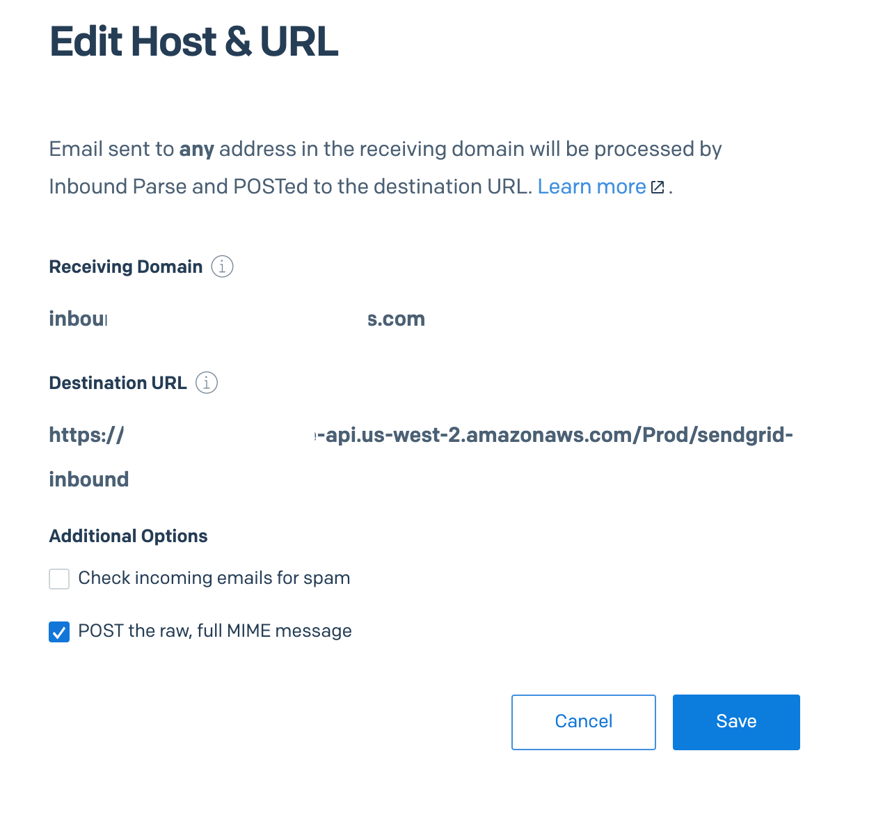

# SendGrid Inbound Parse with Signature Verification

A starter kit for an AWS serverless solution for securely processing inbound emails from SendGrid's Inbound Parse webhook. This system provides secure email reception, parsing, storage, and pub/sub messaging capabilities to trigger additional processing.

**Important**: This is a starter kit/blueprint that provides the foundation and architecture. Companies will need to customize the business logic, add production-ready features, and integrate with their existing systems before deploying to production.

## 📋 Navigation
- **← [Main Overview](../../README.md)** - Project overview and quick start
- **→ [Part 2: AI Processing](../Part-2-Process-Inbound-Emails-with-AI/README.md)** - AI-powered email processing

## Overview

This starter kit provides the foundation for building an email processing pipeline that:
- Receives emails via SendGrid Inbound Parse webhook
- Validates email signatures for security
- Parses email content and attachments
- Stores processed data in S3
- Publishes metadata to SNS for downstream processing
- Provides extensible architecture for custom business logic

**Note**: The current implementation includes basic functionality and placeholder business logic. You'll need to customize the handlers and add your specific business requirements before production deployment.

## Architecture

```
SendGrid → API Gateway → Lambda (inbound-email-to-s3) → S3
                                    ↓
                              SQS Queue → Lambda (handle-sqs-messages) → S3 + SNS
                                                                           ↓
                                                              Generic Event Handler
```

## Icon Version


### Components

#### Core Email Processing Stack (Inbound-Email-Store)
- **API Gateway**: Receives webhook calls from SendGrid
- **inbound-email-to-s3**: Validates signatures and stores raw emails
- **SQS Queue**: Buffers email processing requests
- **handle-sqs-messages**: Parses emails and extracts attachments
- **S3 Buckets**: Store raw emails, parsed data, and attachments
- **SNS Topic**: Publishes email metadata for downstream processing

#### Business Logic Stack (Generic-Inbound-Event-Handler)
- **Generic Event Handler**: Processes SNS messages and provides a foundation for implementing custom business logic

**Customization Required**: The Generic Event Handler currently contains placeholder logic. You'll need to implement your specific business requirements here.

## Prerequisites

- AWS CLI configured with appropriate permissions
- AWS SAM CLI installed
- Node.js runtime environment
- SendGrid account with Inbound Parse configured
- Unique S3 bucket name for email storage
- Repo cloned to your local machine as described in [Main Overview](../../README.md)
- AWS Profile configured as described in [Main Overview](../../README.md)
- global.properties file configured as described in [Main Overview](../../README.md)

## Setup Instructions

### 1. Install Dependencies

Install required Node.js libraries for the Lambda layers:

```bash
cd Inbound-Email-Store
npm --prefix ./layers/layer-parse-multipart-data/nodejs install
npm --prefix ./layers/layer-validate-signature install
```

### 2. Create S3 Bucket

Create a new S3 bucket to store the raw version of the inbound emails:

```bash
# Using AWS CLI
aws s3 mb s3://your-unique-bucket-name

# Or create via AWS Console
```

**Important:** S3 bucket names must be globally unique. Choose a descriptive name like `your-company-inbound-emails-2024`.

**Important:** Copy the name of this new bucket and place as the value for the `RawInboundEmailsBucketName` property in your `global.properties` file in the root directory of the project.

### 3. Deploy the Main Email Processing Stack (INBOUND-EMAIL-STORE)

This will spin up a new CloudFormation stack with multiple resources.

```bash
cd Inbound-Email-Store
sam build

# First time deployment (guided)
sam deploy --guided \
  --stack-name INBOUND-EMAIL-STORE \
  --template template.yaml \
  --profile $(cat ../../aws-profile.profile) \
  --capabilities CAPABILITY_NAMED_IAM \
  --parameter-overrides $(cat ../../global.properties | tr '\n' ' ')

# Subsequent deployments
sam deploy \
  --stack-name INBOUND-EMAIL-STORE \
  --template template.yaml \
  --profile $(cat ../../aws-profile.profile) \
  --capabilities CAPABILITY_NAMED_IAM \
  --parameter-overrides $(cat ../../global.properties | tr '\n' ' ')
```

**Important:** Once this stack finishes deploying, take the output from the command for the value `SGInboundEmailToS3Api`. This is the endpoint where SendGrid will POST inbound emails. Copy this value as we will need it later.

### 4. Deploy the Generic Event Handler

This spins up a simple lambda file that subscribes to the SNS topic that publishes when emails have finished processing. This is a starter implementation that provides the foundation for whatever functionality you want to add. [**Part 2**](../Part-2-Process-Inbound-Emails-with-AI/README.md) picks up here!

**Customization Note**: The Generic Event Handler currently contains basic placeholder logic. You'll need to customize this for your specific use case or use it as a starting point for more complex business logic.

```bash
cd ../Generic-Inbound-Event-Handler
sam build

# First time deployment (guided)
sam deploy --guided \
  --stack-name GENERIC-INBOUND-EVENT-HANDLER \
  --template template.yaml \
  --profile $(cat ../../aws-profile.profile) \
  --capabilities CAPABILITY_NAMED_IAM \
  --parameter-overrides $(cat ../../global.properties | tr '\n' ' ')

# Subsequent deployments
sam deploy \
  --stack-name GENERIC-INBOUND-EVENT-HANDLER \
  --template template.yaml \
  --profile $(cat ../../aws-profile.profile) \
  --capabilities CAPABILITY_NAMED_IAM \
  --parameter-overrides $(cat ../../global.properties | tr '\n' ' ')
```

### 5. Configure SendGrid Webhook Public Key

Now we need to create setup a Inbound Parse webook.

1. Decide on the [`authenticated email domain`](https://www.twilio.com/docs/sendgrid/ui/account-and-settings/how-to-set-up-domain-authentication) that you want to use to receive inbound emails
2. Set up the proper MX records in your DNS provider [[`more details`](https://www.twilio.com/docs/sendgrid/for-developers/parsing-email/setting-up-the-inbound-parse-webhook#set-up-an-mx-record)]
3. Log into your SendGrid account
2. Navigate to **Settings** →  **Inbound Parse**
3. Click **Add Host & URL** to create a new Inbound Parse
4. Enter the subdomain and select your verified domain from the dropdown list
5. In the **Destination URL** enter the endpoint that you copied from at the end of strep 3 above
6. Check the box that says **POST the raw, fill MIME message**
7. Click **Add**



### 6. Add Signature Verification to your Inbound Parse

There are two options when securing webhooks coming from Inound Parse: **oauth** and **signature**. You can add either or both of these methods to a security policy to an existing Inboud Parse. More information can be found on [`this doc`](https://www.twilio.com/docs/sendgrid/api-reference/settings-inbound-parse/create-a-parse-webhook-security-policy).

For this demo, we are going to use **signature** which will add a header to every request that you will be able to verify using a public key that you will get in subsequent step.

1. Create a new Webhook Security Policy

```
curl -x -X POST https://api.sendgrid.com/v3/user/webhooks/security/policies \
--header "Authorization: bearer <<YOUR_API_KEY_HERE>> \
--data '{ "name": "inbound policy", "signature": {"enabled": true} }
```

2. **Important** In the response from that command, copy the **id** or the policy and also the value of the **public_key** in the signature object of the response.
3. Paste the value of the **public_key** property in to the `global.properties` file to replace the value of `SendGridWebhookPublicKey`.

```properties
SendGridWebhookPublicKey="YOUR_SENDGRID_WEBHOOK_PUBLIC_KEY_HERE"
```

4. Lastly, attach the policy to the Inbound Parse that you configured above with a curl command like this:

```
curl -X PATCH https://api.sendgrid.com/v3/user/webhooks/parse/settings/your-parse.domain.com \
--header "Authorization: bearer <<YOUR_API_KEY_HERE>> \
--header "Content-Type: application/json \
--data '{ "url": "<your-endpoint-from-step-3-SGInboundEmailToS3Api>", \
"spam_check":false, "send_raw": true, "security_policy": "<ID-copied-from-step-6-2-above>" }
```

### 7. Re-Deploy the Main Email Processing Stack (INBOUND-EMAIL-STORE)

Because we made important changes to `../../global.properties`, we need to redeploy the INBOUND-EMAIL-STORE to pick up those values. Run the commands below to build and then deploy (update) the stack.

```bash
sam build

sam deploy \
  --stack-name INBOUND-EMAIL-STORE \
  --template template.yaml \
  --profile $(cat ../../aws-profile.profile) \
  --capabilities CAPABILITY_NAMED_IAM \
  --parameter-overrides $(cat ../../global.properties | tr '\n' ' ')
```

### 8. TRY IT OUT!

Send any email to any user at the domain (`anyone@your-parse.domain.com`) that you configured for inbound parse. Check the S3 buckets and the lambda logs to see your emails getting ingest by your new inbound parse system!

## File Structure

```
Part-1-SendGrid-Inbound-Parse-with-Signature-Verification/
├── Inbound-Email-Store/                    # Core email processing stack
│   ├── lambdas/
│   │   ├── inbound-email-to-s3/           # Webhook receiver and validator
│   │   └── handle-sqs-messages/           # Email processor and parser
│   ├── layers/
│   │   ├── layer-parse-multipart-data/    # Multipart parsing utilities
│   │   └── layer-validate-signature/      # SendGrid signature validation
│   ├── template.yaml                      # SAM template
│   └── samconfig.toml                     # SAM configuration
├── Generic-Inbound-Event-Handler/         # Business logic stack
│   ├── lambdas/
│   │   └── generic-handler/               # Main Lambda function
│   │       ├── app.mjs                    # Lambda handler code
│   │       └── package.json               # Dependencies
│   ├── template.yaml                      # SAM template
│   └── samconfig.toml                     # SAM configuration
└── README.md                              # This file
```

## Lambda Functions

### Inbound-Email-Store Stack

#### inbound-email-to-s3
- **Purpose**: Receives webhook calls from SendGrid
- **Features**: 
  - Signature validation
  - Input sanitization
  - Raw email storage to S3
  - SQS message queuing

#### handle-sqs-messages
- **Purpose**: Processes queued email messages
- **Features**:
  - Email parsing with mailparser.js
  - Attachment extraction and storage
  - Metadata extraction
  - SNS message publishing

### Generic-Inbound-Event-Handler Stack

#### generic-handler
- **Purpose**: Processes SNS events and provides foundation for custom business logic
- **Features**:
  - Receives structured email metadata
  - Provides starter implementation for custom processing
  - Extensible for AI integration, routing, and notifications

**Customization Required**: This handler currently contains placeholder logic. You'll need to implement your specific business requirements before production use.

## Data Storage

### S3 Structure
```
your-bucket/
├── {messageId}/
│   ├── email.json                    # Parsed email data
│   └── email-attachments/            # Extracted attachments
│       ├── attachment1.pdf
│       └── attachment2.jpg
└── raw-emails/                       # Raw email storage
    └── {timestamp}-{messageId}.eml
```

### SNS Message Format
```json
{
  "messageId": "unique-message-id",
  "messageTimeStamp": 1640995200000,
  "subject": "Email Subject",
  "from": "sender@example.com",
  "to": "recipient@example.com",
  "attachments": 2,
  "contentTypes": ["text/plain", "text/html"]
}
```

### Common Use Cases

This starter kit provides the foundation for:
- **Email Summarization**: Use AI services to summarize email content
- **Content Categorization**: Route emails based on content analysis
- **Notification Workflows**: Send alerts for specific email types
- **CRM Integration**: Automatically create leads or tickets
- **Document Processing**: Analyze and process email attachments

**Implementation Required**: These use cases require additional development and customization beyond what's provided in this starter kit.

## Security Features

- **Signature Validation**: Verifies emails are from SendGrid
- **Input Sanitization**: Prevents injection attacks
- **IAM Roles**: Least-privilege access patterns
- **VPC Integration**: Optional network isolation
- **Encrypted Storage**: All data encrypted at rest and in transit

## ⚠️ Limitations

### **Payload Size Constraints**
- **API Gateway Limit**: 10 MB maximum payload size for REST endpoints
- **SendGrid Capability**: Supports up to 30 MB email payloads
- **Impact**: Emails with large attachments exceeding 10 MB will be rejected by API Gateway

### **When This Architecture Works Well**
- **Small to Medium Attachments**: Perfect for typical business emails with standard attachments
- **Text-Heavy Emails**: Excellent for emails without large file attachments
- **Standard Use Cases**: Ideal for most customer support, sales, and general inquiry scenarios

### **Alternative Solutions for Large Attachments**
If you need to handle larger email attachments, consider an architectural alternative such as:

1. **Application Load Balancer (ALB)**: Replace API Gateway with ALB for higher payload limits
2. **Direct S3 Streaming**: Put a service behing the ALB that stream payloads directly to S3 bucket
3. **S3 Bucket Event**: set an onCreate trigger to kick off next lambda when a new object is saved

### **Monitoring Recommendations**
- **Enable API Gateway Logging**: Track requests rejected due to size limits
- **Set Up Alerts**: Monitor for 413 Payload Too Large errors
- **Size Analytics**: Track email size patterns to inform architectural decisions


## Monitoring

Monitor the system through:
- **CloudWatch Logs**: Function execution logs for all components
- **CloudWatch Metrics**: Performance and error metrics
- **S3 Access Logs**: Storage access patterns
- **SNS Metrics**: Message publishing statistics
- **X-Ray Tracing**: Request tracing (optional)

## Troubleshooting

### Common Issues

1. **Deployment Fails**
   - Verify AWS credentials and permissions
   - Check that S3 bucket name is unique
   - Ensure all required parameters are in `../../global.properties`
   - Verify the Inbound-Email-Store stack is deployed before Generic-Inbound-Event-Handler

2. **Webhook Not Receiving Emails**
   - Verify SendGrid inbound parse configuration
   - Check API Gateway endpoint URL
   - Review CloudWatch logs for errors
   - Ensure domain MX records point to SendGrid

3. **Signature Validation Failures**
   - Verify SendGrid webhook public key is correct
   - Check that the key is properly formatted in `../../global.properties`

4. **Email Processing Errors**
   - Review SQS queue for failed messages
   - Check Lambda function logs
   - Verify S3 bucket permissions

5. **SNS Not Receiving Messages**
   - Verify the SNS topic ARN matches between stacks
   - Check Lambda function permissions for SNS access

### Log Locations

- **API Gateway**: CloudWatch Logs → API Gateway
- **Lambda Functions**: CloudWatch Logs → `/aws/lambda/{function-name}`
- **SQS**: CloudWatch Metrics → SQS
- **SNS**: CloudWatch Metrics → SNS

## Cost Optimization

- **S3 Lifecycle Policies**: Automatically archive old emails
- **Lambda Concurrency**: Configure appropriate limits
- **SNS Filtering**: Reduce downstream processing costs
- **Serverless Architecture**: Pay only for actual usage

## Integration with Part 2

This Part 1 system integrates seamlessly with [**Part 2**](../Part-2-Process-Inbound-Emails-with-AI/README.md) (AI Processing) by:
- Providing the SNS topic that triggers AI processing
- Storing email data in S3 for AI analysis
- Maintaining the same data structure and message format
- Supporting the foundation for a complete email processing pipeline

**Note**: Part 2 also requires customization and additional development to meet production requirements.

## Support

For issues or questions:
1. Check CloudWatch logs for error details
2. Review this documentation
3. Verify deployment order and dependencies

## Next Steps

After successful deployment:
1. Test email delivery to your configured address
2. **Implement custom business logic** in the Generic Event Handler (required for production)
3. **Set up comprehensive monitoring and alerting** (required for production)
4. Consider deploying [**Part 2**](../Part-2-Process-Inbound-Emails-with-AI/README.md) for AI-powered email processing
5. **Integrate with external systems** (CRM, ticketing, etc.) - required for production
6. **Add security hardening** beyond basic signature verification
7. **Implement proper error handling and recovery** mechanisms

**Important**: This starter kit provides the foundation, but significant additional development is required before production deployment.