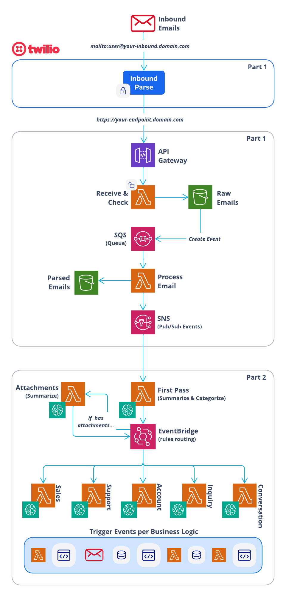

# SendGrid Inbound Parse + AI Processing

A comprehensive AWS serverless solution that combines secure email reception with intelligent AI-powered processing. This system receives emails through SendGrid's Inbound Parse webhook, processes them with AWS Bedrock AI, and provides intelligent categorization, routing, and automated response capabilities.

## 🚀 What This Project Does

This solution creates a complete intelligent email processing pipeline that:

### **Part 1: Secure Email Reception**
- **Securely receives emails** via SendGrid Inbound Parse webhook with signature verification
- **Processes email content** including parsing, attachment extraction, and metadata extraction
- **Stores email data** in S3 with organized structure for easy retrieval
- **Provides extensible architecture** for implementing custom business logic

### **Part 2: AI-Powered Processing**
- **Processes emails with AI** using AWS Bedrock for categorization and summarization
- **Routes emails intelligently** to specialized handlers based on content and context
- **Generates automated responses** through integration with outbound email systems
- **Handles attachments** with specialized processing and analysis

## 🎯 Why This Project is Helpful

### **Enterprise-Ready Email Intelligence**
- **Security First**: Built-in signature verification ensures emails are authentic
- **AI-Powered**: Smart categorization into sales, support, account, and inquiry categories
- **Scalable Architecture**: Serverless design handles varying email volumes automatically
- **Cost Effective**: Pay only for what you use with AWS Lambda, S3, and Bedrock
- **Reliable**: Built-in error handling, retry logic, and monitoring

### **Developer-Friendly**
- **Modular Design**: Separate concerns for easy maintenance and testing
- **Extensible**: Clean interfaces for adding custom business logic
- **Well Documented**: Comprehensive documentation and examples
- **Production Ready**: Includes monitoring, logging, and troubleshooting guides

### **Common Use Cases**
- **Customer Support**: Automatically categorize and route support emails to appropriate teams
- **Sales Lead Processing**: Identify and prioritize sales opportunities from inbound emails
- **Account Management**: Handle account-related inquiries and updates automatically
- **Document Processing**: Analyze and process email attachments intelligently
- **Notification Systems**: Process inbound notifications and trigger workflows

## 🏗️ High-Level Architecture

## ASCII Version

```
┌─────────────────────────────────────────────────────────────────────────────────┐
│                              Part 1: Email Reception                            │
│  ┌─────────────┐    ┌─────────────┐    ┌─────────────┐    ┌─────────────┐       │
│  │   SendGrid  │───▶│ API Gateway │───▶│   Lambda    │───▶│     S3      │       │
│  │Inbound Parse│    │             │    │(inbound-    │    │   Storage   │       │
│  │   Webhook   │    │             │    │email-to-s3) │    │             │       │
│  └─────────────┘    └─────────────┘    └─────────────┘    └─────────────┘       │
└─────────────────────────────────────────────────────────────────────────────────┘
                                        │
                                        ▼
┌─────────────────────────────────────────────────────────────────────────────────┐
│                              Part 2: AI Processing                              │
│  ┌─────────────┐    ┌─────────────┐    ┌─────────────┐                          │
│  │ First Pass  │───▶│  Bedrock    │───▶│ EventBridge │                          │
│  │  Function   │    │     AI      │    │   Events    │                          │
│  └─────────────┘    └─────────────┘    └─────────────┘                          │
└─────────────────────────────────────────────────────────────────────────────────┘
                                        │
                                        ▼
┌─────────────────────────────────────────────────────────────────────────────────┐
│                            Specialized Handlers                                 │
│  ┌─────────────┐  ┌─────────────┐  ┌─────────────┐  ┌─────────────┐             │
│  │   Sales     │  │  Support    │  │   Account   │  │  Inquiry    │             │
│  │  Handler    │  │  Handler    │  │  Handler    │  │  Handler    │             │
│  └─────────────┘  └─────────────┘  └─────────────┘  └─────────────┘             │
└─────────────────────────────────────────────────────────────────────────────────┘
                                        │
                                        ▼
┌─────────────────────────────────────────────────────────────────────────────────┐
│                            Outbound Integration                                 │
│  ┌─────────────┐    ┌─────────────┐    ┌─────────────┐                          │
│  │ EventBridge │───▶│   SNS       │───▶│  SendGrid   │                          │
│  │   Events    │    │  (Outbound) │    │   Email     │                          │
│  └─────────────┘    └─────────────┘    └─────────────┘                          │
└─────────────────────────────────────────────────────────────────────────────────┘
```

## Icon Version



## 📁 Project Structure

```
SendGrid-Inbound-Parse-plus-AI-Processing/
├── Part-1-SendGrid-Inbound-Parse-with-Signature-Verification/
│   ├── Inbound-Email-Store/              # Core email processing stack
│   ├── Generic-Inbound-Event-Handler/    # Custom business logic stack
│   └── README.md                         # Part 1 detailed documentation
├── Part-2-Process-Inbound-Emails-with-AI/
│   ├── Shared-Layers/                    # Shared Lambda layers
│   ├── Outbound-Emails/                  # Outbound email system
│   ├── Process-Inbound-Email/            # AI processing system
│   └── README.md                         # Part 2 detailed documentation
├── global.properties.example             # Configuration template
├── aws-profile.profile.example           # AWS profile template
└── README.md                             # This file
```

## 🚀 Quick Start

### Prerequisites

- AWS CLI configured with appropriate permissions
- AWS SAM CLI installed
- Node.js runtime environment
- SendGrid account with an API Key with adequate permissions 
- AWS Bedrock access (for Part 2)

### 1. Clone and Configure

```bash
git clone <repository-url>
cd SendGrid-Inbound-Parse-plus-AI-Processing

# Copy and configure your settings
cp global.properties.example global.properties
cp aws-profile.profile.example aws-profile.profile

# Edit aws-profile.profile with your AWS profile
# You will edit the values in global.properties as you work through the project

```

#### Configuration Files Explained

**`aws-profile.profile`**
This file specifies which AWS profile to use for deployment. AWS profiles are locally stored configurations that contain credentials and settings for different AWS accounts or regions.

**`global.properties`**
This file contains all the configuration parameters needed for the system. The file is self-explanatory with clear parameter names and placeholder values.

**Understanding AWS Profiles:**
- AWS profiles are stored in `~/.aws/credentials` and `~/.aws/config` files
- They allow you to manage multiple AWS accounts and regions from a single machine
- Each profile contains access keys, secret keys, and default region settings
- Learn more about AWS profiles in the [AWS CLI Configuration documentation](https://docs.aws.amazon.com/cli/latest/userguide/cli-configure-profiles.html)

**Setting up your AWS profile:**
1. **Option 1: Use existing profile** - If you already have AWS profiles configured, simply enter the profile name in `aws-profile.profile`
2. **Option 2: Create new profile** - Run `aws configure --profile your-profile-name` to create a new profile
3. **Option 3: Use default profile** - If you only have one AWS configuration, you can use "default" as the profile name

**Alternative AWS Access Methods:**
If you prefer not to use AWS profiles, you can also:
- Set environment variables: `AWS_ACCESS_KEY_ID`, `AWS_SECRET_ACCESS_KEY`, `AWS_DEFAULT_REGION`
- Use IAM roles (if running on EC2)
- Use AWS SSO for enterprise environments
- Use temporary credentials from AWS STS

**Example aws-profile.profile content:**
```
my-aws-profile
```
or
```
default
```

## 📚 Detailed Documentation and next steps

Go to the README files linked below for instruction on first deploying Part 1 and then Part 2.

### **Part 1: Email Reception**
See [`Part-1-SendGrid-Inbound-Parse-with-Signature-Verification/README.md`](./Part-1-SendGrid-Inbound-Parse-with-Signature-Verification/README.md) for:
- Complete setup and deployment instructions
- Architecture details and component descriptions
- Configuration options and security features
- Troubleshooting and monitoring guidance

### **Part 2: AI Processing**
See [`Part-2-Process-Inbound-Emails-with-AI/README.md`](./Part-2-Process-Inbound-Emails-with-AI/README.md) for:
- Part 1 is required for Part 2!
- AI categorization and summarization setup
- EventBridge routing and handlers
- Customization and extension patterns
- Deployment order and dependencies

## 🔧 Configuration Overview

### Required Services
- **SendGrid**: Inbound Parse webhook and outbound email delivery
- **AWS Bedrock**: AI model access for email processing (Part 2)
- **AWS Services**: Lambda, S3, SNS, EventBridge, API Gateway

### Key Configuration Files
- `global.properties`: All configuration parameters
- `aws-profile.profile`: AWS profile for deployment

## 🛡️ Security Features

- **Signature Verification**: Validates all incoming emails are from SendGrid
- **AI Model Security**: Secure access to AWS Bedrock models
- **IAM Least Privilege**: Minimal required permissions for all components
- **Encrypted Storage**: All data encrypted at rest and in transit
- **Input Validation**: Email content validation and sanitization

## 📊 Monitoring & Observability

- **CloudWatch Logs**: Detailed execution logs for all components
- **CloudWatch Metrics**: Performance and error rate monitoring
- **EventBridge Metrics**: Event routing and processing statistics
- **Bedrock Metrics**: AI processing performance and costs
- **S3 Access Logs**: Storage access pattern analysis

## 💰 Cost Optimization

- **Serverless Architecture**: Pay only for actual usage
- **Efficient AI Usage**: Optimized prompts reduce Bedrock costs
- **S3 Lifecycle Policies**: Automatic archival of old emails
- **Lambda Concurrency Limits**: Control costs during traffic spikes

## 🔄 Extending the System

### Adding Custom Business Logic
1. Modify the `Generic-Inbound-Event-Handler` lambda (Part 1)
2. Add new category handlers (Part 2)
3. Implement your specific email processing requirements

### Common Extensions
- **Database Integration**: Store email data in DynamoDB or RDS
- **CRM Integration**: Connect sales emails to CRM systems
- **Ticketing Systems**: Route support emails to ticketing platforms
- **Workflow Automation**: Trigger business processes based on email content

## 🆘 Support & Troubleshooting

### Getting Help
1. **Check Logs**: Review CloudWatch logs for error details
2. **Review Documentation**: Consult the detailed README files in each part
3. **Verify Deployment Order**: Ensure Part 1 is deployed before Part 2
4. **Common Issues**: See troubleshooting sections in component READMEs

### Common First Steps
1. Verify AWS credentials and permissions
2. Check that all required parameters are configured
3. Ensure SendGrid webhook is properly configured
4. Verify Bedrock access is enabled (for Part 2)
5. Review CloudWatch logs for specific error messages

## 🤝 Contributing

Contributions are welcome! Please:

1. Fork the repository
2. Create a feature branch
3. Make your changes
4. Add tests if applicable
5. Update documentation
6. Submit a pull request

## 📄 License

This project is licensed under the MIT License - see the LICENSE file for details.

## 🙏 Acknowledgments

- Features SendGrid Inbound Parse secured with Signature Verification
- Built with AWS Serverless Application Model (SAM)
- Leverages AWS Bedrock for AI processing capabilities
- Uses EventBridge for event-driven architecture
- Inspired by modern serverless and AI architecture patterns

---

**Ready to get started?** Begin with [Part 1](./Part-1-SendGrid-Inbound-Parse-with-Signature-Verification/README.md) to set up secure email reception, then optionally add [Part 2](./Part-2-Process-Inbound-Emails-with-AI/README.md) for AI-powered processing capabilities.